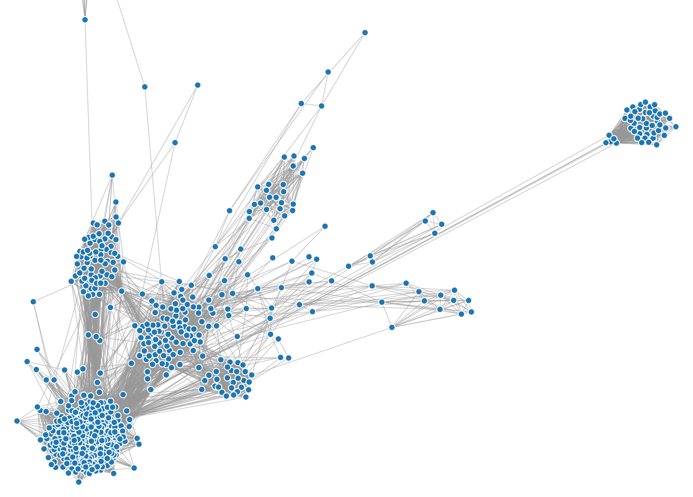

__Warning:__ This code is dumb and makes as many queries to Facebook's API as you have friends. This might get you in trouble.

## friend_graph

Build a graph of your social network by looking at all your friends' mutual friends. D3's force-directed graph makes highly connected groups hug each other close, and you'll find that the end configuration corresponds pretty much exactly to the way you group your friends in your mind.

### Dependencies

- [fbcmd](http://fbcmd.dtompkins.com/) v1.1

### Running

    ./json_builder.py

Then upload `index.html` and `friends.json` to a folder on a server and access it. Be considerate, don't leave your friends' info lying around!

### Planned features

- Add mouseover text to canvas
- SVG graphics without being mad slow
- Color nodes based on Facebook networks that friends are a part of
    - Combine colors for people in several networks
